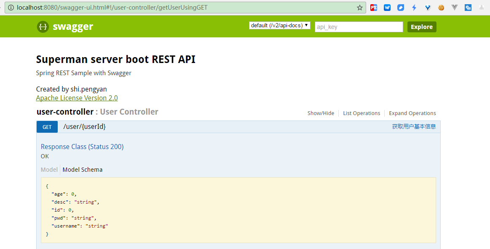
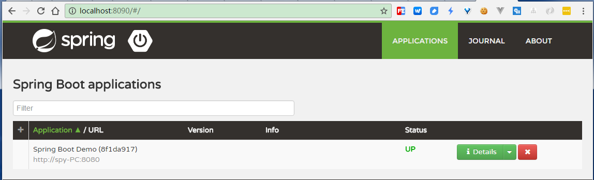
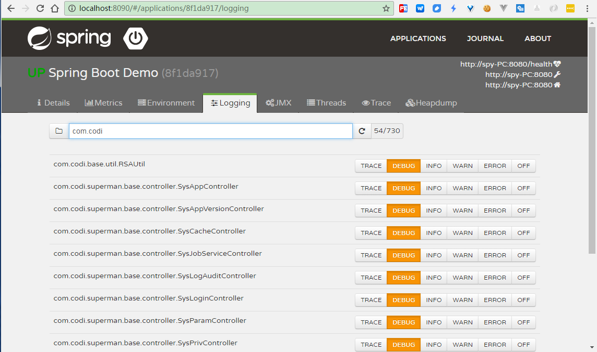
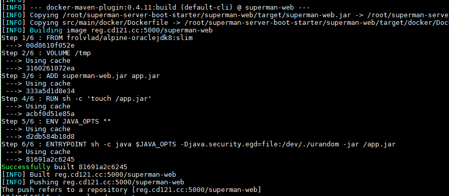

superman boot
-------------

Architecture
------------

-   codi-base
-   codi-superman-base
-   Servlet 3.0
-   Tomcat 8.5.39
-   Redis
-   MySQL
-   Spring-Boot

Project Structure
-----------------

-   TODO

Secondary Development
---------------------

-   修改默认包名（`superman.boot`）,所有涉及到该名称的都必须要修改
-   mybatis生成器配置修改，`superman-biz/src/main/resources/generator/config.properties`
-   修改`SessionFactoryConfig`中包路径

Run
---

### IDE

-   启动`com.codi.superman.boot.web.Application`类`main`方法

### shell

-   本地环境：`sh run_local.sh`
-   开发环境：`sh run_dev.sh`
-   测试环境：`sh run_test.sh`
-   生产环境：`sh run_prod.sh`

REST API
--------

-   常用注解 `https://github.com/swagger-api/swagger-core/wiki/Annotations`
-   `http://localhost:8080/swagger-ui.html`

Spring Boot Admin
-----------------

> 和spring-boot默认集成的监控平台

-   启动superman-console
-   启动superman-web

`http://localhost:8080/`

### 禁用Spring Boot Admin

默认情况下是开启的; 如果不需要，则注销/删除如下配置

-   `superman-web/pom.xml`

<!-- -->

    <dependency>
        <groupId>de.codecentric</groupId>
        <artifactId>spring-boot-admin-starter-client</artifactId>
    </dependency>

-   `superman-console/pom.xml`

<!-- -->

    <dependency>
        <groupId>de.codecentric</groupId>
        <artifactId>spring-boot-admin-server</artifactId>
    </dependency>
    <dependency>
        <groupId>de.codecentric</groupId>
        <artifactId>spring-boot-admin-server-ui</artifactId>
    </dependency>

Docker Build
------------

    cd superman-server-boot-starter

    mvn package -Dmaven.test.skip=true

    cd superman-web
    mvn docker:build -DpushImage

    docker run --name superman -e "SPRING_PROFILES_ACTIVE=prod" -d -p 8081:8080 -t reg.cd121.cc:5000/superman-web

如果没有启动成功，则`docker logs superman`查看docker启动日志
